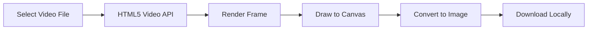

<div align="center">

```
                                         █████                     
                                        ░░███                      
  ██████   ██████    ██████   █████   ███████   ██████  █████ █████
 ███░░███ ░░░░░███  ███░░███ ███░░   ███░░███  ███░░███░░███ ░░███ 
░███ ░░░   ███████ ░███ ░███░░█████ ░███ ░███ ░███████  ░███  ░███ 
░███  ███ ███░░███ ░███ ░███ ░░░░███░███ ░███ ░███░░░   ░░███ ███  
░░██████ ░░████████░░██████  ██████ ░░████████░░██████   ░░█████   
░░░░░░   ░░░░░░░░  ░░░░░░  ░░░░░░   ░░░░░░░░  ░░░░░░     ░░░░░  
```

# 🎬 FrameExtractor 🎬


### ⚡ *Secure Client-Side Video Frame Extraction* ⚡

[](https://framextractor.vercel.app/)
[]()
[]()
[]()
[]()

**`100% browser-based`** • **`No uploads`** • **`High-quality frames`** • **`Fast & secure`**

[🚀 Features](#-features) • [📦 Usage](#-usage) • [🎯 Demo](#-demo) • [🔒 Privacy](#-privacy) • [⚠️ Disclaimer](#%EF%B8%8F-disclaimer)

---

</div>

## 🎯 Overview

**FrameExtractor** is a privacy-first web application that allows you to extract high-quality frames directly from video files inside your browser.

Unlike conventional online converters that upload your content to remote servers, FrameExtractor performs all processing locally on your device using native browser APIs.

No uploads.  
No cloud processing.  
No external storage.  

Your video remains under your control at all times.

---

## ☕ Why FrameExtractor?

```diff
+ 🔒 100% Local Processing — Video never leaves your device
+ ⚡ Instant Frame Capture — Zero server latency
+ 🎯 Original Resolution — No quality degradation
+ 🌐 Works Offline — After first load
+ 🖥️ Cross-Platform — Windows, macOS, Linux
+ 📱 Modern Browser Support — Chrome, Edge, Firefox
```

---

## 🔥 Features

<table>
<tr>
<td>

### 🎬 Frame Capture
- Extract single frames instantly
- Capture precise timestamps
- Smooth video scrubbing
- Real-time preview rendering
- Maintain original resolution

</td>
<td>

### ⚡ Performance
- Hardware-accelerated decoding
- Optimized canvas rendering
- No server round-trips
- Fast timeline navigation
- Efficient memory handling

</td>
</tr>
<tr>
<td>

### 🔒 Privacy
- No file uploads
- No backend processing
- No video tracking
- No external storage
- Fully client-side execution

</td>
<td>

### 📦 Export Options
- PNG export (lossless)
- High-quality JPEG
- Clean file naming
- Instant local download
- Multiple extractions

</td>
</tr>
</table>

---

## 📦 Usage

### 🚀 Online Version

1. Open  
   https://framextractor.vercel.app/
2. Drag & drop your video file
3. Navigate to your desired frame
4. Click **Extract Frame**
5. Download immediately

---

### 💻 Local Development

```bash
git clone https://github.com/henriqqw/FrameExtractor.git
cd FrameExtractor
npm install
npm run dev
```

---

## ⚡ How It Works

### 🎯 Architecture



---

### 🧠 Core Extraction Logic

```javascript
const canvas = document.createElement("canvas");
const ctx = canvas.getContext("2d");

canvas.width = video.videoWidth;
canvas.height = video.videoHeight;

ctx.drawImage(video, 0, 0);

const image = canvas.toDataURL("image/png");
```

All operations occur within the browser runtime.

---

## 🎬 Demo

```
[✔] Video Loaded
[✔] Frame Rendered
[✔] Image Generated
[✔] Download Complete
```

### Common Use Cases

- Thumbnail generation
- Video editing previews
- Presentation stills
- Educational screenshots
- Design references
- Content archiving

---

## 🔒 Privacy

```
╔══════════════════════════════════════════════════════╗
║                                                      ║
║  🔐 ZERO DATA COLLECTION                             ║
║  🔐 ZERO CLOUD PROCESSING                            ║
║  🔐 ZERO FILE STORAGE                                ║
║                                                      ║
║  All processing is executed inside your browser.     ║
║                                                      ║
╚══════════════════════════════════════════════════════╝
```

### Privacy Comparison

| Feature | FrameExtractor | Typical Online Tool |
|----------|----------------|--------------------|
| Upload Required | ❌ No | ✅ Yes |
| Server Processing | ❌ No | ✅ Yes |
| File Retention Risk | ❌ None | ⚠️ Possible |
| Offline Support | ✅ Yes | ❌ No |
| Privacy Level | High | Medium / Low |

---

## 📊 Performance Characteristics

| Metric | Result |
|--------|--------|
| Extraction Speed | Instant |
| Quality Loss | None |
| Network Usage | 0 KB (after load) |
| Processing | Fully Local |
| File Size Limit | Device Memory Dependent |

Performance depends on browser and hardware capabilities.

---

## 🗺️ Roadmap

### 🎯 Version 2.0

- [ ] Batch frame extraction
- [ ] Interval-based extraction
- [ ] ZIP export
- [ ] Adjustable resolution
- [ ] Timeline precision controls
- [ ] Improved mobile experience

### 🚀 Future Enhancements

- [ ] GIF creation
- [ ] Basic video trimming
- [ ] WebAssembly optimization
- [ ] PWA offline mode
- [ ] Dark mode refinement

---

## ❓ FAQ

<details>
<summary><b>Are my videos uploaded?</b></summary>

No. All processing is local.
</details>

<details>
<summary><b>Is there a file size limit?</b></summary>

Limited only by your device memory and browser.
</details>

<details>
<summary><b>Does it reduce quality?</b></summary>

No. Frames retain original resolution.
</details>

<details>
<summary><b>Does it work offline?</b></summary>

Yes, after initial load (if cached).
</details>

<details>
<summary><b>Mobile support?</b></summary>

Yes, depending on browser performance.
</details>

---

## ⚠️ Disclaimer

Frame extraction relies on browser video decoding capabilities.

Large or high-resolution files may increase memory usage.

Compatibility depends on modern browser standards support.

---

## 🤝 Contributing

### 🐛 Bug Reports
Include:
- Browser version
- OS
- Steps to reproduce
- Console errors

### ✨ Feature Requests
Provide:
- Clear description
- Use case
- Technical suggestion

### 🔧 Pull Requests

```bash
git checkout -b feature/NewFeature
git commit -m "Add NewFeature"
git push origin feature/NewFeature
```

---

## 📜 License

MIT License

---

## 👨‍💻 Author

<div align="center">

### henriqqw

https://github.com/henriqqw

</div>

---

<div align="center">

### 🎬 Extract precisely. Keep it private. 🎬

If FrameExtractor helped you, consider giving the repository a ⭐

</div>

